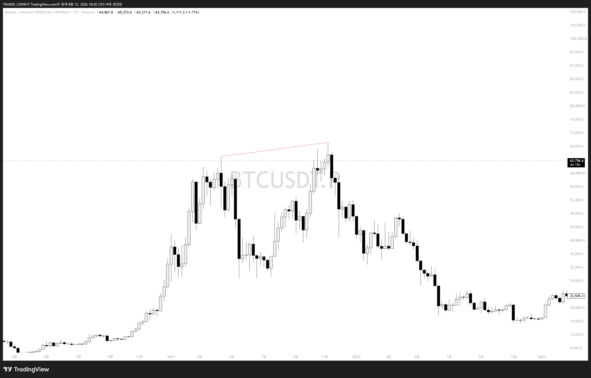
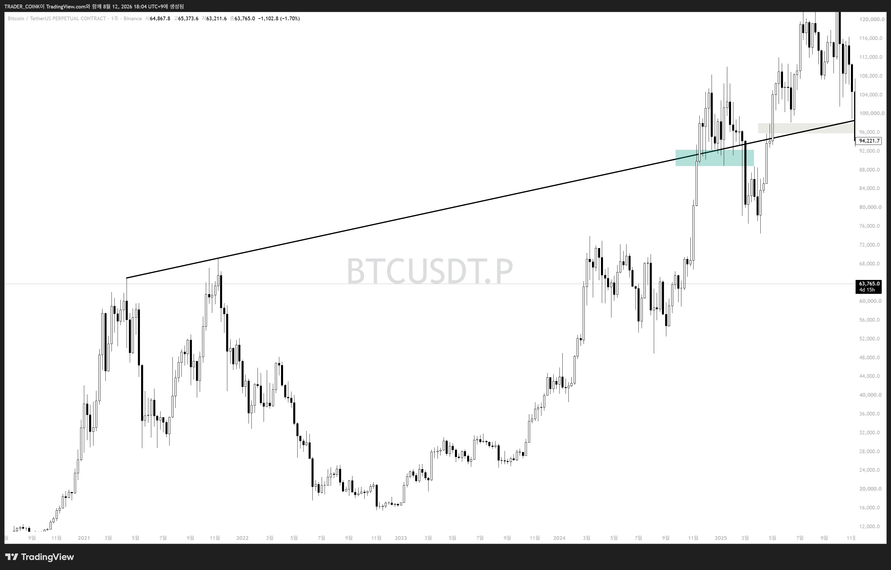

# 빗각(Bit-gak) 정리

**빗각 = 추세선의 상위 개념.** 이름이 다른 이유는 딱 하나 — **매물대**를 미리 예측할 수 있느냐 없느냐입니다.

## 추세선 vs 빗각

| 구분 | 추세선 | 빗각 |
|---|---|---|
| 그리는 방식 | 개인차 심함, 임의로 긋고 수시 수정 | 몇 가지 기본 원칙 존재 |
| 목적 | 현재 추세 방향 확인 | 미래 지지/저항 자리를 미리 표시 |
| 핵심 개념 | 추세 파악용 선 | 매물대 예측용 선 |

추세선은 "지금 추세가 어떤가"를 보는 도구지만, 빗각은 "지금 선을 그어두면 나중에 가격이 이 선에 닿았을 때 지지나 저항이 나올 것"이라는 걸 **미리 알고 대응하기 위한** 도구입니다.

## 실전 예시 (BTC 차트)

### 1단계 — 상승 추세선 긋기

2021년 비트코인의 고점 두 개를 이어서 그린 선. 상승하는 고점끼리 이었으니 '상승 추세선'.

### 2단계 — 오른쪽으로 연장 → 저점 형성 확인

같은 선을 오른쪽으로 길게 늘렸더니, 훗날 그 자리에서 실제로 저점이 형성됨. 이 순간부터 '추세선'이 아니라 '빗각'이라는 이름을 붙입니다.

> **정리:** 빗각 = 원칙에 따라 그은 추세선이 + 미래의 매물대(지지/저항)를 실제로 맞춰내는 것까지 확인된 선을 부르는 이름.
