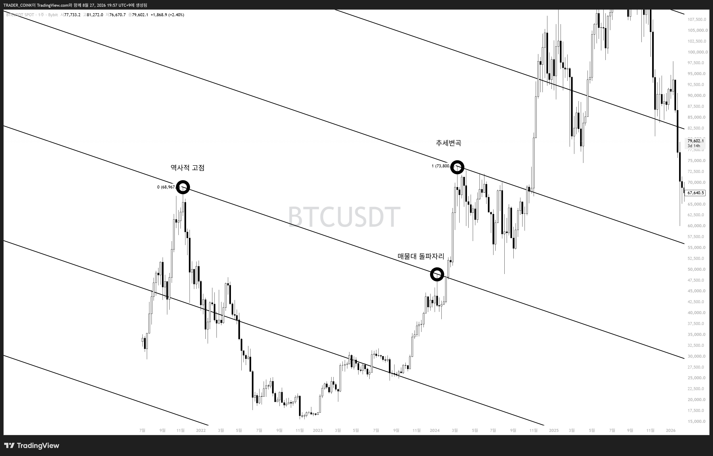
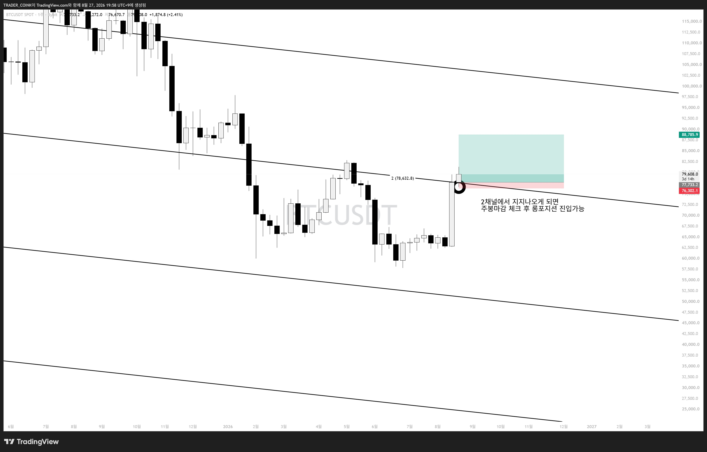
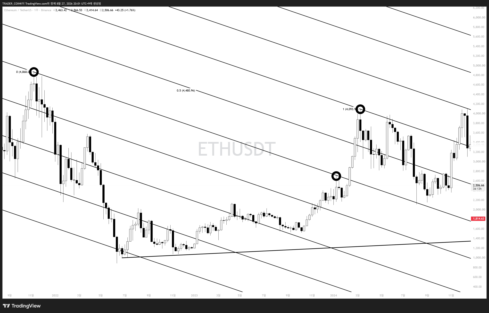
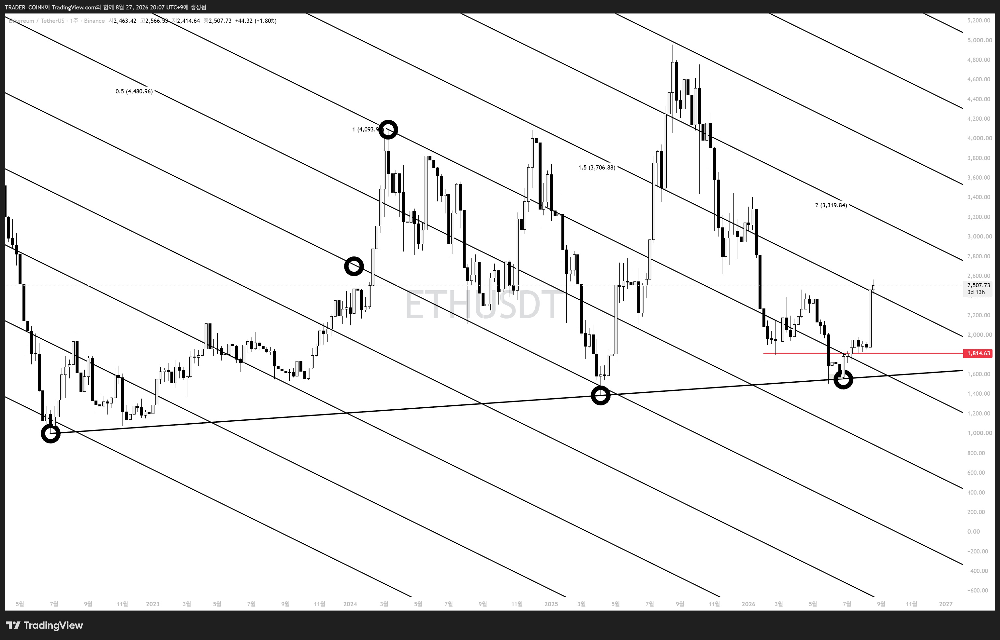

# 빗각 열한번째 시간 — 실전편 1강 (메이저 코인 채널)

그동안 2주간 이론편 10편을 발행했습니다. 이제부터는 **실전편** — 메이저 코인들의 빗각 채널을 실제로 공유합니다.

## 비트코인 장기 채널

**역사적 고점 → 매물대 돌파변곡자리 → 추세변곡**, 세 점으로 작도.

*역사적 고점 → 매물대 돌파변곡자리 → 추세변곡, 세 점으로 작도한 비트코인 장기 채널.*

*현재 2채널 위에서 지지가 나오는 상황. 일봉에서도 수차례 지지 확인. 주봉에 윗꼬리가 있는 지금은 섣불리 진입하지 않고, **주봉 마감까지 확인 후 롱 포지션 진입**을 선호.*

## 이더리움 채널

이더리움도 비트코인과 같은 시기, 같은 지점에 작도하면 됩니다.

*이더리움 채널 작도 예시.*

*이번 저점은 각 사이클 저점을 이은 상승추세선에서 나옴 — 빗각과 추세선을 함께 쓰는 것이 중요. 비트코인과 마찬가지로 채널 위에 안착.*

> **꿀팁:** 코인별 상대강도는 같은 방식으로 작도했을 때 **같은 레벨의 채널 위에 있는지, 아래에 있는지**로 쉽게 비교할 수 있습니다. (예: 비트코인 vs 이더리움/솔라나)

앞으로 메이저 알트코인, 국내주식, 미국주식, 원자재 등 다양한 자산에 실전 예시를 이어서 공유 예정.
