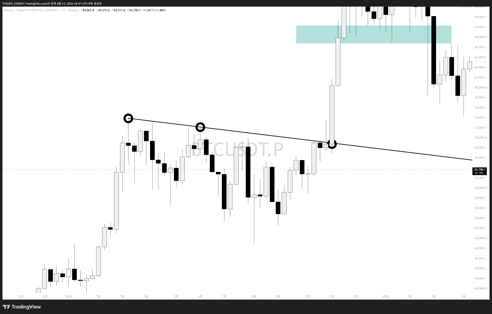
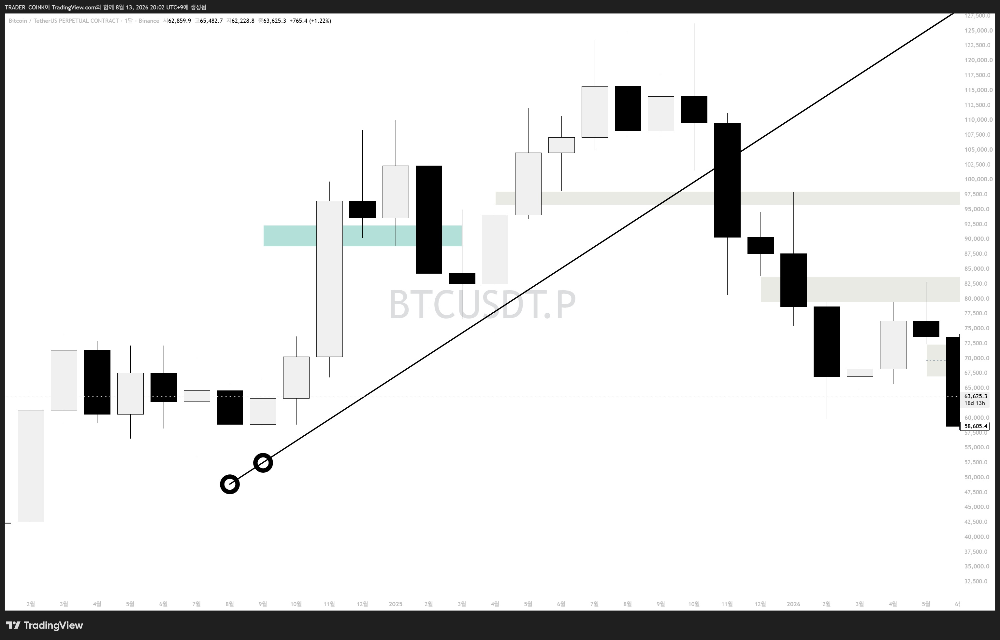
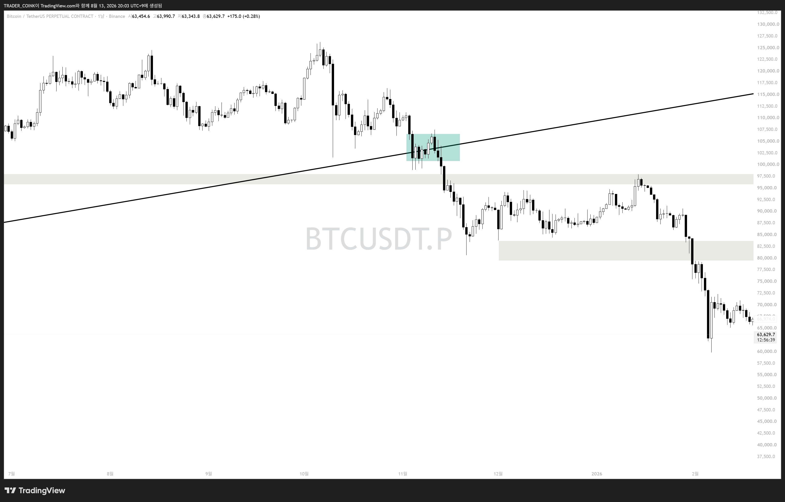

# 빗각 두번째 시간 — 작도 원칙

빗각은 추세선과 다르게 아무렇게나 그리면 안 됩니다. 작도할 때 반드시 지켜야 할 원칙은 딱 **두 가지**입니다.

> 1) 저점과 저점을 이었을 때 → 고점이 나와야 한다 (저저고)
> 2) 고점과 고점을 이었을 때 → 저점이 나와야 한다 (고고저)

## 예시 1 — 고고저 (주봉)

비트코인 주봉 프레임. 검은 원 세 지점 — 고점과 고점을 이었는데 저점이 나옵니다. 빗각으로 인정.

## 예시 2 — 저저고 (월봉 → 일봉으로 확인)

비트코인 월봉 프레임. 저점 두 개를 이었을 때 고점이 나와야 유의미한 빗각인데, 월봉에서는 세 번째 원(음봉이라 잘 안 보임)이 애매합니다.

타임프레임을 일봉으로 낮춰서 확인. 이제 고점이 명확히 나옵니다 → 빗각 인정.

> **핵심 팁:** 본인만의 '빗각이 인정되는 최소 타임프레임(TF)'을 정해두면 좋습니다. 필자는 단기 빗각은 1H까지도 보지만, 유의미한 빗각이 되려면 **4H 이상**을 선호합니다.
