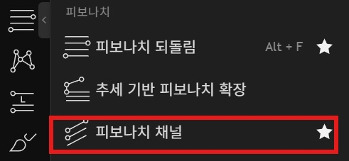
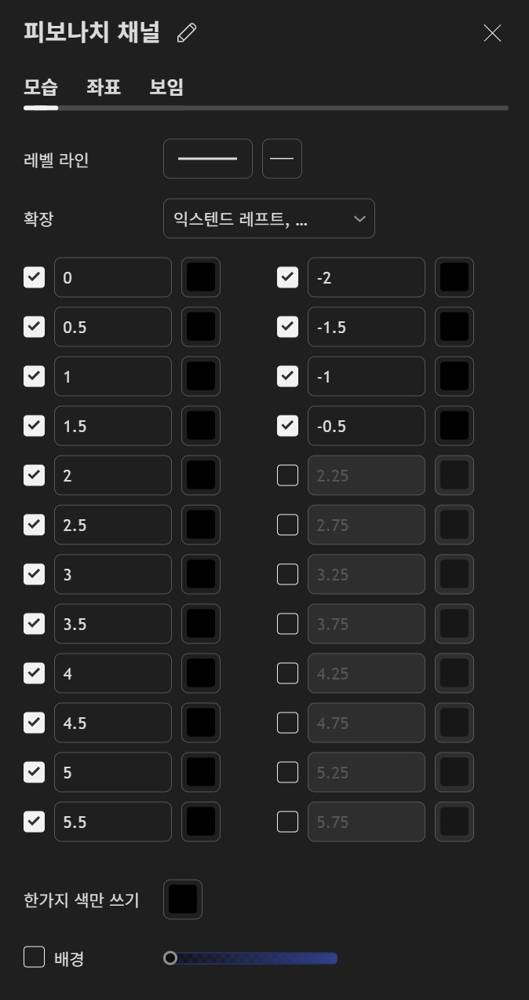
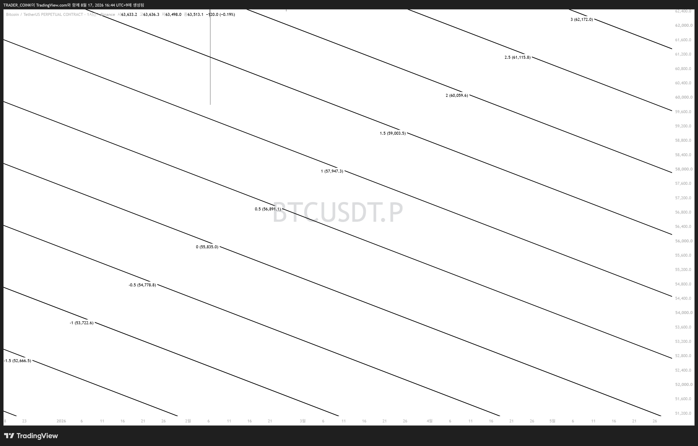

# 빗각 네번째 시간 — 빗각 채널

지금까지 배운 내용: 빗각의 기본 원칙(고고저/저저고), 빗각과 추세선의 차이(매물대 기능). 이번 편은 빗각을 활용한 **"채널"** 작도법입니다.

## 왜 채널을 그리는가

빗각은 그저 선 하나에 불과합니다. 이 선 하나만으로 비트코인의 모든 자리에서 매매 셋업을 세우고 실전에 적용할 수 있을까? **대답은 NO**. 그래서 빗각을 위아래로 연장한 **채널**을 활용합니다.

## 채널 세팅 방법

### 1단계 — 피보나치 채널 도구 선택

TradingView 좌측 툴바에서 피보나치 메뉴 → '피보나치 채널' 선택.

### 2단계 — 레벨 값 세팅

-2부터 6까지 0.5 간격으로 설정 → 총 12개의 선 생성. 배경은 끄고, 색은 한 가지로 통일. 좌우 연장(익스텐드 레프트/라이트) 설정.

### 3단계 — 결과 확인

세팅을 올바르게 마치면 이렇게 좌우로 길게 연장된 평행선들(채널)이 나옵니다.

## 복습

채널을 그리는 이유는 단 하나 — **"빗각" 하나만으로는 커버가 되지 않기 때문**입니다. 단, 채널이고 뭐고 간에 **빗각 작도 자체가 최우선적으로 올바르게 되어 있어야** 합니다. 빗각부터 잘못 그려지면 채널도 당연히 잘못됩니다.

> 다음 편 예고: 이번 주는 "빗각 채널"에 집중해서 계속 다룰 예정
