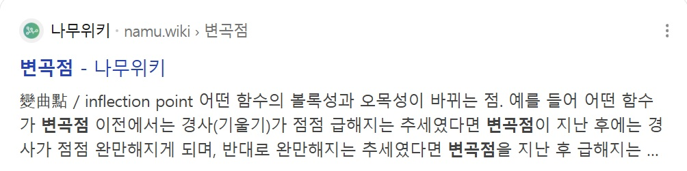
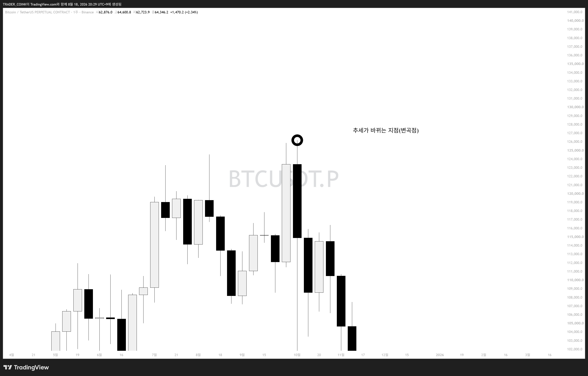

# 빗각 다섯번째 시간 — 변곡점

지난 4강에서 피보나치 채널 도구로 빗각 채널 작도 세팅을 배웠습니다. 이번 5강은 빗각·빗각채널을 통틀어 **"어떤 점을 찍어야 하는가"**에 대한 근본 핵심 내용입니다.

## 변곡점

우리는 딱 이 세 글자만 기억하면 됩니다.

### 사전적 정의

나무위키: 변곡점(變曲點) — 어떤 함수의 볼록성과 오목성이 바뀌는 점. 경사가 점점 급해지다가 지난 후에는 완만해지고, 반대로 완만해지다가 지난 후에는 급해지는 지점.

### 차트에 적용하면

이 사전적 정의를 차트로 가져와서 살짝 비틀면: **변곡점 = 추세가 바뀌는 지점**

비트코인 주봉 차트. 검은 원으로 표시된 지점이 바로 상승 추세가 하락으로 바뀌는 변곡점.

## 결론

빗각과 채널을 작도할 때 우리는 **변곡점만 이으면** 됩니다. 물론 거래량 등 유의미한 보조지표와 함께 작도하면 더욱 좋은 빗각이 탄생합니다.

> 복습: 우리는 변곡점을 작도하는 것이다.
