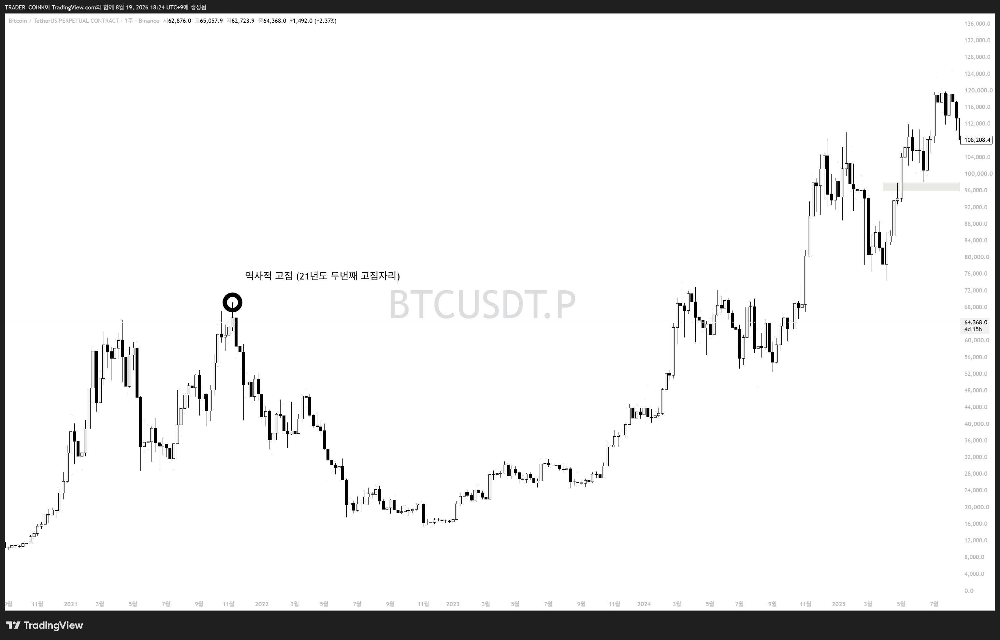
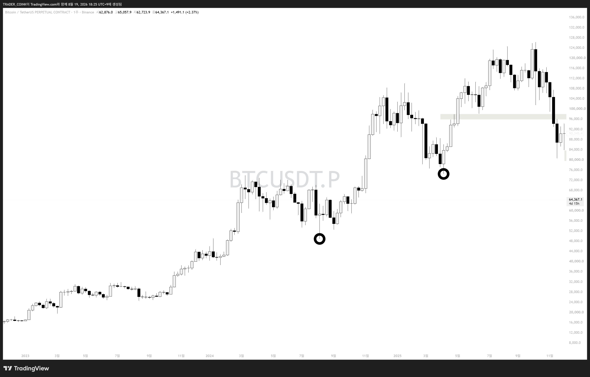

# 빗각 여섯번째 시간 — 변곡점의 종류

5강에서 빗각·빗각채널은 **"변곡점"**을 기준으로 작도해야 한다는 것을 배웠습니다. 6강에서는 구체적으로 어떤 변곡점이 있는지 알아봅니다. 여기서부터는 실전 적용이 필요한 부분이라 어렵게 느껴지는 게 당연합니다.

## 변곡점의 종류 3가지

1. 역사적 고점/저점
2. 추세 변곡점
3. 돌파 변곡점 *(다음 편에서)*

## 1. 역사적 고점/저점

이전 차트에서 가장 높은 고점 혹은 가장 낮은 저점.

### 역사적 고점 예시

21년도 두 번째 고점 자리. 이후 몇 년간 뚫지 못했던, 누가 봐도 명확한 역사적 고점.

### 역사적 저점 예시

검은 원으로 표시된 지점을 역사적 저점으로 취급. 빗각 트레이더들이 잘 언급하지 않는 다소 생소한 활용법이지만 필자는 간혹 사용.

> **역사적 고점** → 추세가 상승에서 하락으로 바뀐 지점 → 변곡 자리
> **역사적 저점** → 추세가 하락에서 상승으로 바뀐 지점 → 변곡 자리

## 2. 추세 변곡점

사실 1번(역사적 고/저점)은 2번(추세 변곡)에 포함되는 개념입니다. 다만 작도 편의를 위해 따로 분류해서 설명한 것. 1번을 이해했다면 2번은 별도 설명이 필요 없음 — **추세가 바뀌는 자리를 찾는 연습**이 가장 중요합니다.

## 3. 돌파 변곡점 (예고)

사실상 가장 핵심 꿀팁. 앞에 세 글자가 생략되어 있는데, 바로 **"매물대"** — 매물대를 돌파하는 자리를 돌파 변곡점이라고 이해하면 됩니다. 이 개념으로 대부분의 빗각 트레이더들이 작도하지 못하는 자리에서도 작도가 가능해집니다.

> 다음 편(7강) 예고: 돌파 변곡점 상세 설명
