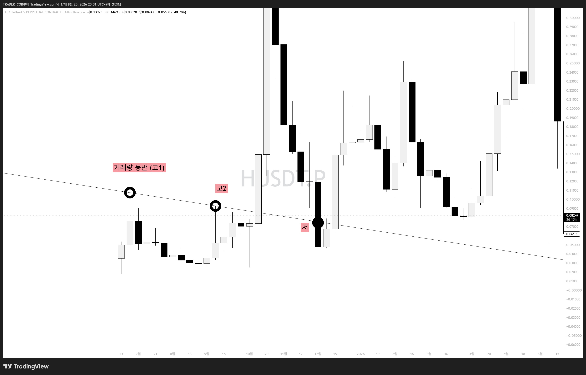
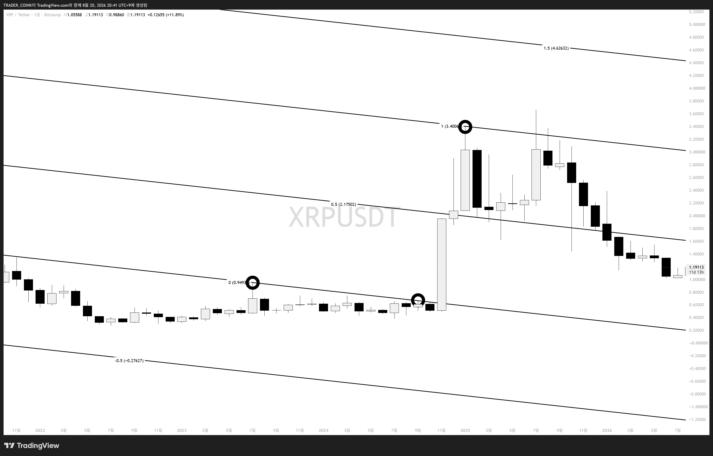

# 빗각 일곱번째 시간 — 돌파변곡

6강에서 변곡점의 3가지 종류(역사적 고점/저점, 추세 변곡점, 돌파 변곡점)와 차이를 배웠습니다. 오늘은 초보자들이 가장 어려워하는 **"돌파변곡"**을 알트코인 예시와 함께 알아봅니다.

## 돌파변곡 = 매물대 돌파

앞에 생략된 세 글자, "매물대"

## 매물대란?

한 줄 요약: **사람들의 평균 단가가 특히 몰려있는 자리.**
이 매물대를 돌파하면 보통 **분출파동**(고각으로 들어올리는 큰 상승)이 나오는 경향이 큼. 대부분의 돌파매매자들은 매물대 돌파를 보고 롱(혹은 반대로 숏) 진입.

> **실전 팁:** 빗각을 잘 쓰려면 매물대를 잘 보는 게 핵심. 알트, 비트, 나스닥, 주식 가리지 말고 매물대로 판단되는 구간을 찾고, 그 구간이 뚫리는 지점을 찾는 연습을 할 것.

## 예시 1 — 알트코인 H

바닥을 기며 저점을 갱신하던 첫번째 점 ~ 두번째 점 사이의 매물을 돌파하려고 윗꼬리가 나옴. → 두번째 점이 돌파변곡으로 인정.

## 예시 2 — 리플(XRP)

첫번째·두번째 점은 매물대 돌파 실패 자리. 세번째 점에서 매물대 돌파 이후 분출파동(급격한 상승)이 나와 그 고점에 '1' 자리를 표시.

> 오늘 배운 매물대 돌파 원리를 빗각 작도에 직접 적용하면, 빗각이 한결 쉽게 느껴집니다.
