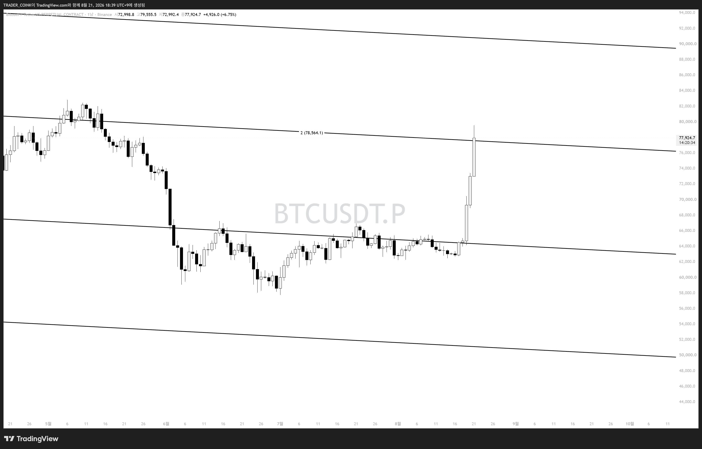
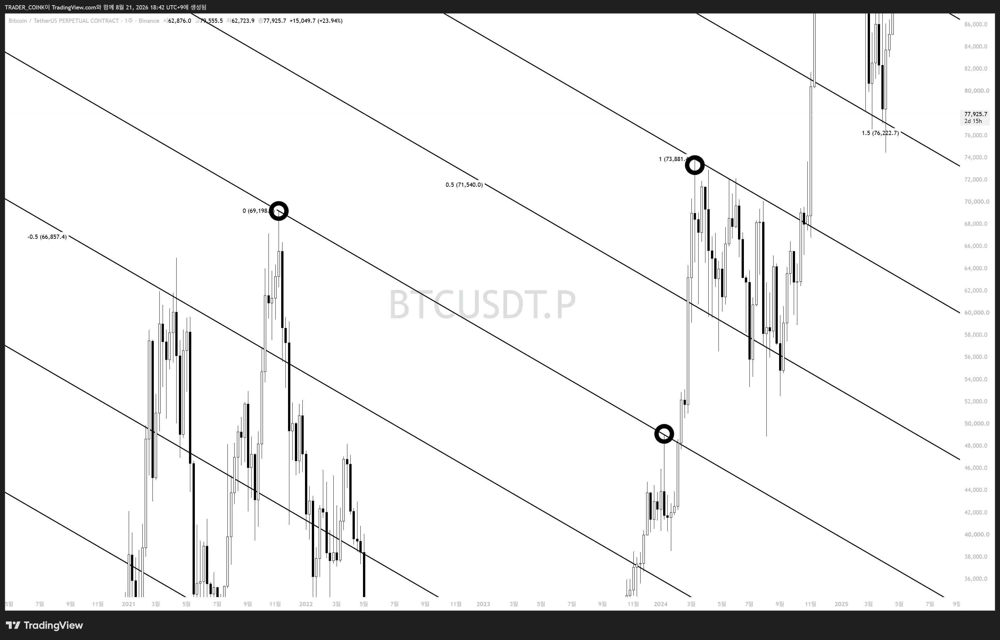

# 빗각 여덟번째 시간 — 실전 대입 (BTC)

1~7강에서 배운 변곡점 기반 빗각·빗각채널 작도를 오늘은 현재 급등 중인 **비트코인 실전 차트**에 대입해봅니다.

## 결과 먼저 확인

지지-리테스트 성공 이후 정확히 그 자리를 밟고 한 칸만큼 급등. 빗각을 봐온 사람이라면 저점에서 어렵지 않게 잡을 수 있었던 자리.

## 어떻게 그렸나 — 점 3개

왼쪽 → 오른쪽 순서로 세 개의 점을 찍어 채널을 작도.

- **첫번째 점**: 21년도 추세변곡이자 역사적 변곡 자리
- **두번째 점**: 돌파변곡 자리
- **세번째 점**: 추세 변곡 자리

이렇게 작도하면 이번 비트코인 상승을 **밑바닥부터 고점까지** 완벽하게 대응할 수 있었습니다.

> 현재 자리는 보수적으로 접근하거나, 다음 채널선에서 지지가 확인될 때 신규 진입 — 반드시 손절가를 세팅하고 진입할 것.

지금까지 배운 변곡점(역사적/추세/돌파) 세 종류를 조합해서 실제 채널을 작도한 실전 예시. 앞으로도 빗각 콘텐츠 연재 예정.
